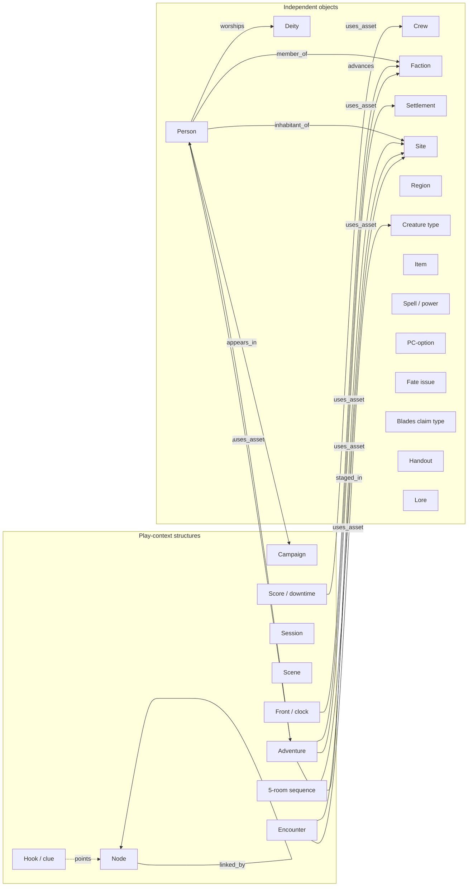

# Research Assignment 005 — Reusable TTRPG Domain Objects and Relationships

**Report ID:** 005  
**Date:** 2026-09-07  
**Analyst:** Opportunity Researcher / Market Research Analyst (Employee 001)  
**Stage:** Domain-object inventory (independent vs play-context)  
**Status:** Complete — awaiting Owner review  
**Path:** `research/assignments/fromResearcher1/005-ttrpg-reusable-domain-objects-and-relationships.md`

This report asks which named things in popular TTRPG books and designer texts are **independent, reusable objects** (a person, a city, a creature type, a god) and which are **narrative or play-context structures** (an adventure, a session, a clue chain, a score). It then asks how those two families relate without treating the play-context as the owner of the world.

It is **not** an opportunity scorecard, product pitch, software design, data schema, or reactivation of any prior TTRPG PDF-ingestion initiative. No copyrighted book prose is reproduced here. Vocabulary is **system-independent**: the same person can appear in a 5e heist, a Castles & Crusades gazetteer, or a Call of Cthulhu city chapter.

Continuity: Assignment 002 split catalogs (Layer D) from procedures of play (Layer B) and shared fiction (Layer E). Assignment 003 tagged book headings and found story trees nested under adventures, with people and items often as children of rooms. Assignment 004 recorded named beings as cards plus nine heading-backed edges, and allowed a hireling gallery with **zero** edges. This assignment does not walk a new PDF folder. It asks a different question of the same evidence: **does the book nest mean the adventure owns the person?**

**Core finding (Inference, grounded below).** Prefer **Person `appears_in` Campaign** and **Adventure `uses_asset` Person** over **Campaign `owns` Person**. Containment in a table of contents is a publishing convenience. Association is what the corpus actually does when the same city, faction, tavern, or monster type shows up in more than one story.

**Do not begin product work.**

---

## 1. Executive Summary

**Yes — popular TTRPG corpora already split reusable objects from play-context.** Gazetteers, bestiaries, and deity catalogs publish people, places, factions, creature types, and gods that later adventures, sessions, and clue-chains **use**. Adventure cards, scores, scenes, nodes, fronts, and 5-room sequences are how play is sliced; they are not the home of the objects.

**Most important findings**

1. **Fact.** City and region products repeatedly print a gazetteer (settlement, sites, people, factions) as one object set, then print adventures, cards, or hooks as a **second** object set that points at the first. The 1989 *City of Greyhawk* boxed set is the cleanest public example: two background books plus twenty-three adventure cards that each develop some already-described city element. ([Wikipedia: The City of Greyhawk](https://en.wikipedia.org/wiki/The_City_of_Greyhawk); [Greyhawk wiki contents list](https://greyhawkonline.com/greyhawkwiki/The_City_of_Greyhawk); [RPGnet review of the box split](https://www.rpg.net/reviews/archive/classic/rev_3624.phtml))

2. **Observation.** Two adventures can share a city, a tavern, and a faction without sharing a plot. *Waterdeep: Dragon Heist* and *Waterdeep: Dungeon of the Mad Mage* are sold as a 1–20 pair under one city, but independent write-ups treat the stories as separate: urban faction hunt above, megadungeon below, with the Yawning Portal as a shared site rather than a shared narrative. ([Wikipedia: Dungeon of the Mad Mage](https://en.wikipedia.org/wiki/Waterdeep:_Dungeon_of_the_Mad_Mage); [RPG Stack Exchange on overlap](https://rpg.stackexchange.com/questions/212763/how-important-is-waterdeep-dragon-heist-to-the-story-of-waterdeep-dungeon-of-t); [D&D Beyond bridging note](https://www.dndbeyond.com/posts/365-how-to-bridge-the-gap-from-dragon-heist-to-dungeon))

3. **Fact.** Catalogs of **creature type** and **deity** are published without a host adventure. The *Monster Manual* is a core bestiary of alphabetized creature types; *Tome of Horrors Complete* is a 700-monster A–Z; *Deities of the Lost Lands, Volume 1* collects forty-plus gods in one place. ([Wikipedia: Monster Manual](https://en.wikipedia.org/wiki/Monster_Manual); [Frog God: Tome of Horrors Complete](https://www.froggodgames.com/products/tome-of-horrors-complete); [Frog God: Deities of the Lost Lands vol. 1](https://www.froggodgames.com/products/deities-of-the-lost-lands-volume-1-gods-of-the-empires))

4. **Observation.** Designer texts that tell GMs how to *prep play* name a different family: **scene**, **node**, **clue**, **front**, **clock**, **score**, **downtime**, **5-room sequence**. Those texts treat people and places as inputs to the prep, not as children of the session. ([Sly Flourish, Eight Steps](https://slyflourish.com/eight_steps_2023.html); [Alexandrian, node-based design](https://thealexandrian.net/wordpress/7949/roleplaying-games/node-based-scenario-design-part-1-the-plotted-approach); [Dungeon World SRD, Fronts](https://www.dungeonworldsrd.com/gamemastering/fronts/); [Blades SRD, session cycle](https://bladesinthedark.com/basics/); [Johnn Four, 5-Room Dungeon](https://www.roleplayingtips.com/5-room-dungeons/))

5. **Analysis.** Assignment 004’s nine edges already refuse a social network. Fortune Hunters is a hireling gallery with **zero** edges: a person card can exist with no ties. That is the same pattern as a Monster Manual entry with no lair and no adventure: **independence is allowed**. `appears_in` is already one of the nine. This assignment adds a second play-context verb, `uses_asset`, so the adventure is the *user*, not the *owner*.

6. **Inference.** Recording **Campaign owns Character** would contradict how publishers reuse Waterdeep, Greyhawk, Absalom, Stoneheart Valley, Yggsburgh, Masks city chapters, bestiary types, and gods. Recording **Character `appears_in` Campaign** and **Adventure `uses_asset` Character** matches the books.

**Analyst confidence:** **High** that the independent/context split is real across gazetteers, catalogs, and designer prep texts; **moderate** that any one verb list (`appears_in`, `uses_asset`, plus the nine 004 edges) is complete; **low** that every named heading in a keyed dungeon should be lifted out of its room (some people really are only that room’s occupant).

---

## 2. Research Question

If we look at popular TTRPG books and free designer texts, which named things are **reusable domain objects** that can appear in more than one story, and which are **narrative or play-context structures** that organize a particular run of play — and how should those two families be related without treating the campaign or adventure as the owner of the objects?

Constraints from Owner:

- Research markdown only. No software schema. No Mahogany design. No Rust, YAML, database, or UI.
- System-independent vocabulary.
- Label **Fact / Observation / Analysis / Inference / Unknown**.
- Continuity with Assignments 002–004, including the nine edges and Fortune Hunters’ zero edges.
- Free web URLs for sources used in this pass; prior assignment corpora remain heading-structure evidence, not quotations.

---

## 3. Method and Sources

**Window:** Sources accessed 2026-09-07.

**Signals used**

- Free web descriptions of published products (Wikipedia, publisher pages, PathfinderWiki, Greyhawk wiki, RPGnet reviews, Frog God / Troll Lord product pages).
- Free SRDs already cited in Assignment 002 (Blades, Fate, Dungeon World fronts).
- Free designer essays already listed in Assignment 002 (Alexandrian nodes/clues; Lazy DM scenes; 5-room dungeon).
- Continuity documents: Assignments 002, 003, 004 (heading trees and the nine-edge character card).

**Not used**

- Body prose from paid adventures.
- A new PDF-folder walk.
- Software, vault, or storage design.
- Invented ownership graphs.

**Labels**

| Label | Meaning |
| --- | --- |
| **Fact** | Directly present in a named free page, SRD, or prior assignment heading record |
| **Observation** | Recurring pattern across independent products or texts |
| **Analysis** | Structured interpretation for this assignment |
| **Inference** | Reasonable conclusion not stated by the sources |
| **Unknown** | Material gap |

**Limitations**

- This pass does **not** open the Owner’s local PDFs. Waterdeep, Greyhawk, Absalom, Masks, and Lost Lands claims rest on free public descriptions plus 003/004 heading patterns where those folders were already walked.
- Product marketing (“years of adventures”) is treated as **observation of how the book is sold**, not as proof of table reuse.
- No table ethnography: reuse is documented as *publishing* reuse (same object printed or pointed at in more than one product or chapter), not as what a given group actually recycled.

---

## 4. Observed Inventory

**Observation.** Across the sources, named things fall into two families. The families are not “fiction vs rules.” A faction can be fiction *and* reusable. A score can be a rules procedure *and* still be play-context. The split is **can this object be pointed at from more than one story?** versus **is this object the story-slice itself?**

### 4.1 Independent / reusable objects (inventory)

These persist when the plot changes. A later adventure, session, or city chapter can point at them.

| Independent object | What it is, in system-independent words | Where it shows up as a first-class printed thing |
| --- | --- | --- |
| **Person** | A named individual (shopkeeper, hireling, investigator pregen, patron) | Greyhawk folk book; Absalom NPC density; Yggsburgh fused office-holders; 004 `entity.npc`; Fortune Hunters gallery |
| **Crew** | A collective treated as a playable/recordable entity, not only a list of people | Blades SRD: crew is created beside characters ([Basics](https://bladesinthedark.com/basics/)) |
| **Faction** | An organization with standing, turf, or political weight | Waterdeep guilds; Greyhawk guilds/conspiracies; Absalom houses/councils; Blades factions |
| **Settlement** | A city or town as a place that can host many stories | Waterdeep; Free City of Greyhawk; Absalom; Yggsburgh; Bard’s Gate / Fairhill in Lost Lands |
| **Site** | A keyed building, dungeon level, tavern, shop, or locale inside or near a settlement | Yawning Portal; Trollskull Manor; Undermountain levels; Yggsburgh locales; Greyhawk quarters |
| **Region / world** | A map-scale container of settlements and sites | Stoneheart Valley; World of the Lost Lands gazetteer; Greyhawk area map; Yggsburgh environs (~1500 sq mi) |
| **Creature type** | A kind of being reusable in many encounters (not one named monster-in-a-room) | *Monster Manual*; *Tome of Horrors* A–Z (004); SRD monster catalogs |
| **Deity** | A named god, usually under a pantheon/church | 004 deity-catalog; *Deities of the Lost Lands* vol. 1 |
| **Item** | A named object, relic, MacGuffin, or mundane gear type | 003 magic-item appendices vs object-cues vs recipes; 004 `wields` |
| **Spell / power** | A named permitted operation (spell, stunt, move) | 002 Layer D catalogs; 003 `entity.pc-option.spell` |
| **PC-option** | A reusable character-building piece (class, species, playbook, background template) | 003 player-options book; 004 Eye of Itral backgrounds |
| **Fate issue** | A campaign-scale dramatic pressure recorded as an aspect | Fate SRD current / impending issues ([Setting’s Big Issues](https://fate-srd.com/fate-core/settings-big-issues)) |
| **Blades claim** | A seized benefit/turf node on a crew’s claim map | Blades SRD faction game ([Faction Game](https://bladesinthedark.com/faction-game)) |
| **Handout** | A player-facing artifact (clipping, letter, map sheet, matchbook) | Masks of Nyarlathotep handout folder; 003/004 `reference.handout` |
| **Lore** | History, custom, law, myth, culture that is not itself a scene | Gazetteer chapters; Absalom district write-ups; 003 `lore.*` |

### 4.2 Narrative / play-context structures (inventory)

These organize **this** run of play. They can mention independent objects; they are not those objects.

| Context structure | What it is | Where it is first-class |
| --- | --- | --- |
| **Adventure** | A published or prepared scenario with a plot/situation spine | Greyhawk adventure cards; Dragon Heist vs Mad Mage as separate books; 003 `adventure` product type |
| **Campaign** | A multi-adventure or multi-session frame | Waterdeep 1–20 pairing; Masks as one campaign across cities; Dungeon World campaign front |
| **Session** | One sitting’s worth of play | Blades “TV episode”; Lazy DM prep unit |
| **Scene** | A potential beat in a session, often discarded if it does not occur | Lazy DM “outline potential scenes” ([Scenes as catch-all](https://slyflourish.com/scenes_catch_all_step.html)); 004 festival `story.scene` |
| **Encounter** | A framed conflict or challenge using people, creatures, or sites | 003 keyed rooms; 002 PF2 encounter mode |
| **Node** | A place, person, or scenario that clues can point at | Alexandrian node-based design; Masks city chapters as campaign nodes |
| **Front / clock** | Offscreen pressure that advances unless opposed | Dungeon World fronts; Blades clocks; 002 Layer B |
| **Score / downtime** | Alternating play modes in a session economy | Blades SRD: score then downtime ([Basics](https://bladesinthedark.com/basics/)) |
| **Hook / clue** | A pointer from one node or scene to another | Alexandrian Three Clue Rule; Masks connection lists; Lazy DM secrets and clues |
| **5-room sequence** | A five-beat story template wrapping any location | Johnn Four, 5-Room Dungeon ([Roleplaying Tips](https://www.roleplayingtips.com/5-room-dungeons/)) |

**Analysis.** Assignment 002 already placed catalogs in Layer D and session/score/scene tools in Layer B. Assignment 003 then found those layers **fused on the page**: a keyed room is both a site (independent-ish) and an encounter (play-context). This assignment un-fuses them on purpose. The room heading can still be tagged `story.location`. The **relation** to the adventure is `uses_asset`, not parent-owns-child.

---

## 5. Independent Objects

Each row is what the object **is**, not how a particular game names its stats.

### 5.1 Person

**Fact (004).** Named beings that may open a card: `entity.npc`, `entity.deity`, `entity.monster`, `lore.faction`, `reference.pregen`, `entity.pc-option.background`. Nine edges; a card may have none.

**Fact (004).** Fortune Hunters is a flat hireling gallery with **no guild parent** and **zero edges**. Independence is not a defect in the record; it is what the outline printed.

**Observation.** Greyhawk’s folk book and Absalom’s “400 NPCs” marketing describe people as city inventory, available to any group, not as exclusive children of one plot. ([Wikipedia: City of Greyhawk](https://en.wikipedia.org/wiki/The_City_of_Greyhawk); [PathfinderWiki: Absalom, City of Lost Omens](https://pathfinderwiki.com/wiki/Absalom,_City_of_Lost_Omens))

**Inference.** A person is reusable. An adventure may *cast* them. A campaign may be a place they *appear*. Neither owns them.

### 5.2 Crew

**Fact.** Blades creates a **crew** as its own sheet-level entity beside player characters. The crew takes scores, holds turf, and has status with factions. ([Basics](https://bladesinthedark.com/basics/); [Faction Game](https://bladesinthedark.com/faction-game))

**Analysis.** Crew is independent *of a single score*. It is not independent of play: a crew is a campaign-facing collective. Treat it as a reusable object that **appears_in** a campaign and **uses_asset** claims, not as a context structure like `score`.

### 5.3 Faction

**Observation.** Factions are printed in gazetteers (Greyhawk guilds; Absalom houses and district councils; Waterdeep’s Xanathar Guild, Zhentarim, Harpers) and in procedures (Blades status −3 to +3). The *organization* is reusable; the *standing with the player crew* is play-context (section 10).

**Fact.** Blades licensing splits faction **mechanics** (status, clocks, claims) from Duskwall **setting IP** (named Duskwall NPCs, maps, artwork). ([Licensing](https://bladesinthedark.com/licensing)) That split is legal evidence that “faction as system object” is not the same record as “this city’s named gang.”

### 5.4 Settlement, site, region/world

**Fact.** Gazetteer products exist whose spine is place, not plot: Greyhawk *Gem of the Flanaess*; Absalom district chapters; Yggsburgh town + environs; *World of the Lost Lands* described as a system-neutral gazetteer with **no adventures in the main book**. ([Lost Lands BackerKit FAQ](https://lost-lands.backerkit.com/faq); [Troll Lord: Yggsburgh](https://trolllord.com/product/castles-crusades-castle-zagyg-yggsburgh-classic-reprint/); [Strange Assembly on Absalom](https://www.strangeassembly.com/2022/review-absalom-city-of-lost-omens-pathfinder))

**Fact (004).** Yggsburgh headings often **fuse** person and place (residence + office). The person **is** the site for `rules` / `owner_of`. That is still an independent pair, not an adventure child.

**Observation.** *Stoneheart Valley* compiles three previously separate modules into one regional mini-campaign around Fairhill — the region is the durable object; the three plots are loads on it. ([Frog God: Stoneheart Valley](https://www.froggodgames.com/products/14743))

### 5.5 Creature type

**Fact.** A *Monster Manual* is a catalog of creature types with statistics and habits, not a plotted adventure. The 1977 book compiled 350+ alphabetized monsters as a core supplement. ([Wikipedia: Monster Manual](https://en.wikipedia.org/wiki/Monster_Manual))

**Fact (004).** *Tome of Horrors Complete* is a flat A–Z letter-bucket bestiary, **not** the 003 Horde culture/lair people-type. Catalog names get cards with **no location edge** unless a lair heading exists.

**Analysis.** An encounter **uses_asset** a creature type. The type does not `appear_in` only one dungeon. Named unique monsters (Halaster; a specific dragon) behave more like **Person**.

### 5.6 Deity

**Fact (004).** Product type `deity-catalog`: pantheon, then church, then god leaf. Edges: `worships`, `member_of`.

**Fact.** *Deities of the Lost Lands: Volume 1* presents forty-plus gods of Foerdewaith / Hyperborea in one volume, including names that already appeared across Frog God / Necromancer adventures. ([Product page](https://www.froggodgames.com/products/deities-of-the-lost-lands-volume-1-gods-of-the-empires))

**Inference.** Adventures `uses_asset` a deity (temple, cult, cleric option). The god is not owned by *Tomb of Abysthor* or *Orcus 34th*.

### 5.7 Item, spell/power, PC-option

**Observation (002–003).** These are Layer D catalogs. 003 split items into magic-item appendix, recipe, object-cue, and trinket. PC-options nest class → subclass → feature. They are reused whenever a later book or table points at the same named piece.

**Fact (004).** `wields` attaches a named item to a person, cult, or MacGuffin heading. That is association, not adventure-ownership.

### 5.8 Fate issue

**Fact.** Fate game creation writes **current** and **impending** issues as aspects available for the whole game. Issues can also be attached later to a location or organization. They can change, resolve, or be replaced in play. ([Setting’s Big Issues](https://fate-srd.com/fate-core/settings-big-issues); [Faces & Places](https://fate-srd.com/fate-core/faces-places))

**Analysis.** An issue is reusable *across scenes* and is not a scene. It is closer to a campaign-facing object than to a session beat. See section 12: it is the most ambiguous independent object.

### 5.9 Blades claim

**Fact.** Every claim on a crew map is already controlled by a faction; seizing it is an attack (typically −2 status with the holder, sometimes +1 with enemies). Some claims count as turf; others grant listed benefits while held. ([Faction Game](https://bladesinthedark.com/faction-game))

**Analysis.** The **claim type** (infirmary, lookouts, turf box) is a reusable catalog piece. A **held claim** is a play-state. Do not collapse those two.

### 5.10 Handout and lore

**Fact.** Masks editions include a large handout set (clippings, letters, matchbook, maps). Chaosium describes play as investigators following clues across cities in whatever order they choose. ([Wikipedia: Masks of Nyarlathotep](https://en.wikipedia.org/wiki/Masks_of_Nyarlathotep); [Chaosium product copy](https://www.chaosium.com/masks-of-nyarlathotep-pdf-1/))

**Observation (003).** Maps and handouts appear as **sibling headings** of rooms, not as unnamed art. Lore headings (settlement, faction, religion) cluster in gazetteers.

**Inference.** A handout is an independent object that a clue-structure **uses**. Lore is independent color/institution text that many adventures can `uses_asset`.

---

## 6. Context Structures

### 6.1 Adventure and campaign

**Fact.** Greyhawk prints twenty-three **adventure cards** as a separate physical component from the two background books; each card develops an element already in the city material. ([Wikipedia](https://en.wikipedia.org/wiki/The_City_of_Greyhawk); [Greyhawk wiki card list](https://greyhawkonline.com/greyhawkwiki/The_City_of_Greyhawk))

**Fact.** *Dungeon of the Mad Mage* is published as the second part of the Waterdeep storyline and is a 23-level Undermountain crawl starting at the Yawning Portal; reviewers and players treat it as combinable with *Dragon Heist* **or** runnable alone. ([Wikipedia: Mad Mage](https://en.wikipedia.org/wiki/Waterdeep:_Dungeon_of_the_Mad_Mage); [RPG.SE](https://rpg.stackexchange.com/questions/212763/how-important-is-waterdeep-dragon-heist-to-the-story-of-waterdeep-dungeon-of-t))

**Analysis.** Campaign is a **frame** (1–20 Waterdeep; Masks globe-spanning). Adventure is a **load** on reusable city/dungeon objects. The frame does not own the tavern.

### 6.2 Session, scene, encounter

**Fact.** Lazy DM prep lists eight steps, including review characters, strong start, **outline potential scenes**, secrets/clues, fantastic locations, important NPCs, monsters, rewards. Scenes are brief, disposable, and may never occur. Locations and NPCs are separate steps. ([Eight Steps 2023](https://slyflourish.com/eight_steps_2023.html); [Scenes catch-all](https://slyflourish.com/scenes_catch_all_step.html))

**Observation (003).** Third-party 5e books rarely title `story.scene`; they title locations. **004** used `story.scene` for festival events. Scene is a play-context lens that may sit on a site without being the site.

**Inference.** Encounter **uses_asset** site + creature type + person. The encounter ends; the type and site remain.

### 6.3 Node, hook, clue

**Fact.** Justin Alexander’s Three Clue Rule: for any conclusion the PCs must make, include at least three clues. Node-based design treats locations (and sometimes people) as nodes linked by those clues; Masks of Nyarlathotep is cited as a campaign-scale ancestor. ([Three Clue Rule](https://thealexandrian.net/wordpress/1118/roleplaying-games/three-clue-rule); [Node-based scenario design](https://thealexandrian.net/wordpress/7949/roleplaying-games/node-based-scenario-design-part-1-the-plotted-approach); [Secret Life of Nodes](https://thealexandrian.net/wordpress/45263/roleplaying-games/the-secret-life-of-nodes))

**Fact.** At campaign scale, Alexandrian treats each Masks city as a **campaign node** (a whole scenario) with links between cities; a campaign node can even be a single person rather than a full scenario. ([Secret Life of Nodes, part 2](https://thealexandrian.net/wordpress/45268/roleplaying-games/the-secret-life-of-nodes-part-2-node-based-campaigns))

**Analysis.** **Node** is a play-context role that can be *played by* a settlement, site, or person. The city of Cairo is independent; “Cairo-as-Masks-chapter” is context.

### 6.4 Front / clock; score / downtime

**Fact.** Dungeon World fronts are between-session GM tools: linked dangers, grim portents, impending doom. Adventure fronts are near-term; a campaign front spans the campaign; dangers can move between those layers. ([Fronts SRD](https://www.dungeonworldsrd.com/gamemastering/fronts/))

**Fact.** A Blades session is score (the operation) then downtime (recover, vice, side-projects), then look for the next opportunity. ([Basics](https://bladesinthedark.com/basics/))

**Analysis.** These are **time and pressure procedures** (002 Layer B). A front may point at a reusable faction or deity. The front is not the faction.

### 6.5 5-room sequence

**Fact.** Johnn Four’s 5-Room Dungeon is a five-beat template (entrance/guardian; puzzle/social; trick/setback; climax; reward/twist). It is explicitly not limited to dungeons: any location, any genre. Rooms can be moved to a new path if unused. ([Roleplaying Tips](https://www.roleplayingtips.com/5-room-dungeons/))

**Inference.** The sequence is play-context wrapping **uses_asset** sites. Easy-to-move is evidence the structure is not identical to the geography.

---

## 7. Relationship Inventory

**Analysis.** Keep Assignment 004’s nine heading-backed edges for **in-world** ties the outline already printed. Add a small play-context set so campaigns and adventures can point at objects without owning them. Do **not** add `owns` as a campaign→person verb. Do **not** mint `allied_with`, `knows`, or backstory (004 still holds).

### 7.1 In-world edges (from Assignment 004)

| rel | what it records | reuse note |
| --- | --- | --- |
| `inhabitant_of` | Person under shop / quarters / farm / room | Survives if another adventure visits that site |
| `owner_of` | Place heading **is** the person site | Gazetteer fact, not a plot fact |
| `quest_giver_for` | *Working for Name* / offer / meeting | Often play-context **and** in-world; see §10 |
| `enemy_of` | Named antagonist heading | May be lasting or only-this-adventure; ambiguous |
| `member_of` | Nested under faction / church / household | Reusable if the faction is reusable |
| `worships` | Temple / shrine / god | Deity catalogs make this independent of plot |
| `rules` | Office fused into residence / palace title | Yggsburgh person-is-place |
| `wields` | Named item attached to person / cult / MacGuffin | Item remains reusable if the wielder changes |
| `appears_in` | Named figure as a moving plot heading across sites | **Already** the non-ownership verb for “showed up here” |

**Fact (004).** Fortune Hunters: **zero edges**. Empty lists are allowed.

### 7.2 Play-context verbs (this assignment)

| rel | from | to | meaning |
| --- | --- | --- | --- |
| `appears_in` | Person, faction, item, crew, deity, handout, lore | Campaign, adventure, session, scene, node | The object is present in that slice of play |
| `uses_asset` | Adventure, session, scene, encounter, node, score, 5-room sequence, front | Any independent object | The slice of play *casts* or *points at* the object |
| `linked_by` | Node or site | Node or site | A **clue / hook / handout** points from one to the other |
| `staged_in` | Encounter, scene, score | Site or settlement | Where the slice is set |
| `advances` | Front / clock | Faction, deity, region, issue | Offscreen pressure on a reusable object |

**Preferred pair (Inference).**

- Person `appears_in` Campaign  
- Adventure `uses_asset` Person  

**Rejected pair.** Campaign `owns` Person. Adventure `owns` Site. Campaign `owns` Creature type.

### 7.3 How this sits on 002–004

| Prior record | 005 reading |
| --- | --- |
| 002 Layer D catalogs | Independent objects |
| 002 Layer B procedures (scene, score, downtime, fronts, clues) | Context structures |
| 002 Layer E situation | Mix: reusable lore vs this-session stakes |
| 003 parent/child heading nest | Publishing containment; **not** ownership |
| 004 nine edges | Keep; they are in-world association |
| 004 Fortune Hunters zero edges | Independence without relations is valid |
| 004 `appears_in` | Promote to the default campaign/adventure link |

---

## 8. Containment vs Association

**Fact (003).** Adventure nesting is almost always plot → site → room, with map and handout as **siblings** of rooms. That is a **book tree**.

**Analysis.** Three different “insides” get confused if they share one verb:

| Kind of “in” | Example | Record as |
| --- | --- | --- |
| **Publishing containment** | NPC heading nested under Shop A in the PDF | `inhabitant_of` Shop A (004 nest-to-edge). Not: Adventure owns Person |
| **Geographic containment** | Site in a district in a settlement in a region | Settlement/site/region association. Weak, durable, not a plot |
| **Play containment** | Scene during Session 12 of Campaign | Context-in-context (`appears_in`). Still does not own the person who walked on |

**Observation.** Greyhawk’s box *physically* separates gazetteer books from adventure cards. Absalom prints hooks as **sidebars** on district pages. Lazy DM puts NPCs and locations on different prep steps from scenes. Blades puts Duskwall names outside the SRD. All four are publishers drawing a line between **asset** and **use**.

**Inference.** When a heading nest and a reuse pattern disagree, believe reuse. Waterdeep’s Yawning Portal is nested in two different adventure books; the tavern is not two objects. *Dragon Heist* `uses_asset` Yawning Portal; *Mad Mage* `uses_asset` Yawning Portal; the portal `appears_in` both adventures.

**Counter-pattern (Observation).** Some keyed-dungeon occupants have no life outside that room. 004 already said: monster appendix gets **no** location edge unless a lair heading exists. Those persons/monsters can remain local. Local is not the same as owned-by-campaign; it is **no extra edges**, Fortune Hunters-style.

---

## 9. Cross-Story Reuse Examples

Bibliographic titles only; no body text.

### 9.1 Waterdeep: *Dragon Heist* and *Dungeon of the Mad Mage*

**Fact.** Mad Mage is published as following Dragon Heist; both are the Waterdeep storyline; Mad Mage is a 23-level Undermountain crawl that starts in the Yawning Portal and includes Skullport as a link to the city’s underside. ([Wikipedia: Mad Mage](https://en.wikipedia.org/wiki/Waterdeep:_Dungeon_of_the_Mad_Mage))

**Observation.** Independent commentators describe **shared city, little shared plot**: Dragon Heist is an urban faction treasure hunt (with a city-guide back half); Mad Mage is a megadungeon that can be moved under some other city with modest work. Factions such as the Xanathar Guild can appear in both; the heist’s four seasonal villains are not Mad Mage’s spine. ([RPG.SE](https://rpg.stackexchange.com/questions/212763/how-important-is-waterdeep-dragon-heist-to-the-story-of-waterdeep-dungeon-of-t); [Black Citadel summary of Heist structure](https://blackcitadelrpg.com/waterdeep-dragon-heist/); [D&D Beyond bridging article](https://www.dndbeyond.com/posts/365-how-to-bridge-the-gap-from-dragon-heist-to-dungeon); [Sly Flourish on Heist Ch. 2 factions](https://slyflourish.com/wdh_chapter_2.html))

**Analysis.** Reused independents: **settlement** (Waterdeep), **site** (Yawning Portal, Undermountain), **faction** (Xanathar Guild and others), **person** (tavern-keeper and faction agents as continuity options). Context that does **not** reuse: Heist’s seasonal villain path vs Mad Mage’s level-by-level crawl. Prefer `uses_asset` / `appears_in`. *Owning* the Xanathar Guild as a Heist child would make Mad Mage’s later use a contradiction.

### 9.2 City of Greyhawk: gazetteer + adventure cards

**Fact.** 1989 boxed set: *Gem of the Flanaess* (city and surroundings), *Folk, Feuds, and Factions* (people, guilds, conspiracies, plus four scenarios), four maps, **23 adventure cards** plus a monster-stat summary card. Each short adventure develops something already in the background. ([Wikipedia](https://en.wikipedia.org/wiki/The_City_of_Greyhawk); [Greyhawk wiki](https://greyhawkonline.com/greyhawkwiki/The_City_of_Greyhawk); [RPGnet](https://www.rpg.net/reviews/archive/classic/rev_3624.phtml))

**Inference.** This is the textbook split: independent **settlement / site / person / faction** in the books; context **adventure** on the cards. Cards `uses_asset` the gazetteer. The city does not live inside card 12.

### 9.3 Absalom, *City of Lost Omens*

**Fact.** Lost Omens city book: on the order of 400 pages, 11 districts, 250+ locations, 400 NPCs, poster map; sold as a locale for years of Pathfinder play, with sidebars that hook and that **cross-reference existing adventure paths and PFS scenarios**. ([PathfinderWiki](https://pathfinderwiki.com/wiki/Absalom,_City_of_Lost_Omens); [Strange Assembly review](https://www.strangeassembly.com/2022/review-absalom-city-of-lost-omens-pathfinder))

**Observation.** The settlement is the product. Adventures are guests. That is the inverse of “campaign owns city.”

### 9.4 Lost Lands: Stoneheart Valley and the world gazetteer

**Fact.** *Stoneheart Valley* collects three earlier modules (*The Wizard’s Amulet*, *The Crucible of Freya*, *The Tomb of Abysthor*) plus extra material as the first Lost Lands regional offering around Fairhill. ([Frog God product page](https://www.froggodgames.com/products/14743))

**Fact.** *The World of the Lost Lands* is described as system-neutral, gazetteer-heavy, with **no adventures in the main book**, locating previously published adventures in one world context. ([BackerKit FAQ](https://lost-lands.backerkit.com/faq); [Tenkar’s Tavern Kickstarter note](https://www.tenkarstavern.com/2019/02/kickstarter-world-of-lost-lands-system.html))

**Inference.** Region/world is independent. Multiple adventures `uses_asset` the same valley and pantheon. Deity catalogs later pull gods out of those adventures into a dedicated book (§5.6) — reuse in the opposite direction (adventure → catalog), which ownership-by-adventure cannot describe cleanly.

### 9.5 Yggsburgh

**Fact.** *Castle Zagyg: Yggsburgh* is a 256-page town + 1500-square-mile environs gazetteer (20,000-person walled town, many locales), prelude to the dungeon, portable into other fantasy campaigns. ([Troll Lord](https://trolllord.com/product/castles-crusades-castle-zagyg-yggsburgh-classic-reprint/); [RPGnet review](https://www.rpg.net/reviews/archive/11/11571.phtml); [EN World reprint announcement](https://www.enworld.org/threads/luke-gygax-brings-back-gary-gygaxs-castle-zagyg.699482/))

**Fact (004).** Strong edges from fused residence + office: `rules`, `inhabitant_of`, `owner_of`. Person **is** the place.

**Analysis.** Reuse here is **horizontal** (town usable beside later castle volumes, or dropped into another world), not two Waterdeep-style adventure books. Still not campaign-owned: the gazetteer is the object; Castle Zagyg is a neighboring site the town `appears_in` stories about.

### 9.6 Masks of Nyarlathotep: city nodes

**Fact.** Campaign chapters are cities (New York, London, Cairo, Kenya/Nairobi, Shanghai; later Peru and Australia). Play is clue-driven and not a fixed city order. Handouts include pointers that span chapters (classic example: a New York matchbook pointing at a Shanghai bar). ([Wikipedia](https://en.wikipedia.org/wiki/Masks_of_Nyarlathotep); [Chaosium](https://www.chaosium.com/masks-of-nyarlathotep-pdf-1/); [Alexandrian on Masks as campaign nodes](https://thealexandrian.net/wordpress/45263/roleplaying-games/the-secret-life-of-nodes))

**Analysis.** Independent: **settlement**, **site**, **person**, **handout**, **faction/cult**. Context: **campaign**, **adventure-chapter**, **node**, **clue**. Cairo is not owned by the campaign; the campaign `uses_asset` Cairo as a node. A later Keeper could reuse the city chapter’s places without running Masks’ global ritual — Unknown at table, but the published split already supports the verbs.

### 9.7 Monster Manual / Tome of Horrors; deity catalogs

**Fact.** Bestiaries and deity books are whole-product catalogs. PathfinderWiki notes ToH Complete as a compilation whose open content was later referenced by hundreds of Paizo works — creature types traveling **into** other books. ([ToH Complete](https://www.froggodgames.com/products/tome-of-horrors-complete); [PathfinderWiki: Tome of Horrors Complete](https://pathfinderwiki.com/wiki/Tome_of_Horrors_Complete); [Monster Manual](https://en.wikipedia.org/wiki/Monster_Manual))

**Fact (004).** ToH: catalog names, no location edge by default. Deity-catalog: pantheon → church → god.

**Inference.** Creature type and deity are the strongest independent objects in the corpus. If even these were `owned` by the first adventure that mentioned them, later bestiary law and god books would be nonsense.

### 9.8 Blades: faction status / claims, plus the Duskwall IP split

**Fact.** Status and claims are SRD procedures. Seizing a claim hits faction status. Crew type supplies a default claim map. ([Faction Game](https://bladesinthedark.com/faction-game))

**Fact.** SRD users **may not** use Duskwall setting, NPCs, artwork, or maps; they must invent original setting material on the Blades procedures. ([Licensing](https://bladesinthedark.com/licensing); Assignment 002 already flagged this)

**Analysis.** Two reuse stories: (1) **procedure objects** (crew, claim type, status track, score/downtime) reuse across Forged in the Dark games; (2) **setting objects** (Duskwall people and streets) are deliberately *not* in the reusable SRD. That is the independent/context split enforced as copyright, not only as GM advice.

### 9.9 Fate issues; Alexandrian nodes/clues; Lazy DM scenes

**Fact.** Fate issues are game-level aspects; faces and places are listed beside them as people and locations to interact with. ([Issues](https://fate-srd.com/fate-core/settings-big-issues); [Faces & Places](https://fate-srd.com/fate-core/faces-places))

**Fact.** Alexandrian nodes are linked by clues; Lazy DM scenes are a session list that can be thrown away, while NPCs and fantastic locations are other steps. ([Nodes](https://thealexandrian.net/wordpress/7949/roleplaying-games/node-based-scenario-design-part-1-the-plotted-approach); [Eight Steps](https://slyflourish.com/eight_steps_2023.html))

**Observation.** All three designer texts **already** talk as if people/places are assets and scenes/nodes/issues are how play looks at them.

---

## 10. Context-Dependent Relations

Some relations are real **only inside a play-context**. They should not be stored as if they were gazetteer facts.

| Relation | Depends on | If you freeze it as in-world truth |
| --- | --- | --- |
| Faction **status** with the crew (−3..+3) | This campaign’s Blades faction game | A different crew in the same city would not inherit it |
| **Held** claim / turf | After a successful seize, until lost | The claim type remains; the holding is state |
| `quest_giver_for` | This adventure’s patron block | The same person may be only a shopkeeper in the next book |
| `enemy_of` when the heading is “this module’s antagonist” | This adventure | Greyhawk card villains vs lasting guild rivalries — not the same |
| Fate **issue** on the table | This game’s issue list; may resolve | The Scar Triad as a faction can outlive the issue aspect |
| Clue `linked_by` | This mystery’s revelation list | The matchbook is still a handout object if used in another scenario |
| Scene attendance | Whether the Lazy DM scene occurred | Discarded scenes never happened; the NPC still exists |
| Encounter roster | This fight | Creature type remains reusable |

**Analysis.** 004 forbade minting `knows` and `allied_with` from prose. This assignment adds a second caution: do not mint **lasting** `enemy_of` or `quest_giver_for` from a single adventure card. Those edges are allowed when the heading says so; mark them as play-context if they do not also appear in the gazetteer.

**Inference.** Status, heat, clocks, and “which seasonal villain is active” are **campaign state**, not independent objects. Independent objects may *be the targets* of that state (`advances`, `uses_asset`).

---

## 11. Temporal Relations

**Observation.** Play-context structures are often **ordered in time**. Independent objects usually are not (a city does not “happen after” a tavern).

| Temporal pattern | What is sequenced | What stays put |
| --- | --- | --- |
| Blades **score → downtime → next score** | Session economy | Crew, factions, claims (state changes; objects remain) |
| PF2 / 002 **encounter / exploration / downtime modes** | How time is sliced | Settlements and catalogs |
| Dungeon World **grim portents → impending doom** | Front advances | The faction/deity/place being pressured |
| Fate **issues change in the long game** | Which aspects are currently true | Faces and places |
| Masks **city order is player-chosen** | Campaign path | City chapters as reusable nodes |
| Greyhawk **cards in any order** | Adventure sequence | Gazetteer |
| 5-room **beats 1–5** | Dramatic sequence | The underlying site (can be swapped) |
| Waterdeep **levels 1–5 then 5–20** | Campaign pacing | Shared city/dungeon geography |
| 003 **plot → chapter → site → room** | Reading/play order in a keyed book | Maps as siblings; appendices as catalogs |

**Fact (004).** `appears_in` already covers a named figure as a **moving** plot heading across sites — a temporal tour without ownership.

**Analysis.** Time belongs to context structures and to **state on** objects (status, held claims, resolved issues). It does not turn a person into a child of Session 7.

---

## 12. Ambiguous Cases

Label **Unknown** where the corpus disagrees with itself.

1. **Keyed-room occupant vs reusable person.** 003 shopkeepers live under shops. 004 nest-to-edge records `inhabitant_of`. Some of those people are Greyhawk-grade reusable; some are dungeon dressing. **Unknown** per heading without a second appearance. Default: card + `inhabitant_of` only (Fortune Hunters-adjacent), not campaign ownership.

2. **Fate issue.** Independent enough to outlast a scene; contextual enough that it is invented at game creation and may be erased. **Analysis:** treat as a campaign-facing **object**, not as a scene, but do not pretend it is a gazetteer fact like a river.

3. **Blades claim.** Catalog piece vs held state (section 5.9). Always split type from holding.

4. **Crew.** Object (sheet, upgrades) that only exists because a campaign is being played. Similar to a party. **Inference:** independent relative to scores; not independent of play the way Waterdeep is independent of Heist.

5. **Front vs faction.** A front is a GM notebook clustering dangers. Those dangers are often factions, places, or gods. **Do not** merge the notebook with the faction.

6. **Node vs site.** Alexandrian allows a node to be a person, a dungeon, or a whole city-scenario. **Node** is the role; **site/person** is the player of the role.

7. **Handout vs clue.** The physical/player artifact is an object. Its *pointer* (`linked_by`) is context. One matchbook can be reprinted as a prop without implying the global Masks ritual.

8. **Lore.** Assignment 003 lore headings are book parts. Some lore is only true for one adventure’s twist (5-room “Room Five” revelations). **Unknown** without a gazetteer echo.

9. **PC-option vs this PC.** Class/playbook is a catalog object. The filled character in *this* campaign `appears_in` the campaign and is not a reusable domain object in the same sense — except pregens (`reference.pregen`), which 004 already treated as cards with `appears_in`.

10. **Unique named monster vs creature type.** Halaster is a person. “intellect devourer” is a type. Heist/Mad Mage commentary even discusses *when* to show the type so the later book keeps its reveal — evidence the **type** is shared inventory. ([DM of the Realms on combining the two](https://dmotr.wordpress.com/2019/01/18/combining-dragon-heist-and-dungeon-of-the-mad-mage/))

11. **`quest_giver_for` / `enemy_of`.** Heading-backed in 004, but often adventure-scoped (section 10).

12. **Campaign as object.** A campaign can be named and reused (Waterdeep storyline; Masks). It is still a **context structure**, not a container that owns the Realms.

---

## 13. Implications

**Do not begin product work.** These implications are classification implications only.

1. **Analysis.** Owner “break a campaign into story, items, NPCs” (003/004) is a **use** question. The campaign is a context structure that `uses_asset` items and people. It is not a folder that contains them as exclusive children.

2. **Inference.** The preferred verbs — Person `appears_in` Campaign; Adventure `uses_asset` Person — keep Fortune Hunters valid (person with no edges), keep Yggsburgh valid (person associated with place), and keep Waterdeep/Greyhawk/Absalom/Masks valid (same assets, different stories).

3. **Observation.** 003’s heading walk remains the way to *find* objects in a book. 005 says: after you find them, **do not copy the bookmark parent as ownership**. Convert nest to 004 edges where the nest is in-world; convert adventure/chapter parents to `uses_asset` / `appears_in`.

4. **Analysis.** Layer D catalogs (creature type, spell, PC-option, deity) should never be campaign-owned. Layer B structures (scene, score, front, 5-room, node) should never be filed as people or cities.

5. **Inference.** If a later pass builds any record-keeping aid, empty edge lists must remain legal. Completeness is not a web of everyone knowing everyone (004). Completeness is **knowing which objects are reusable** and **which pointers are only this story**.

---

## 14. Open Questions

- **Unknown.** How often a named Waterdeep person is *mechanically* restated in Mad Mage versus merely assumed as city continuity (secondary sources disagree on NPC overlap volume).
- **Unknown.** Whether Absalom’s 400 NPCs are actually reused in print APs at high rates, or only *available* for reuse (the book claims cross-reference; this pass did not count).
- **Unknown.** Table practice: do groups treat Greyhawk cards as disposable context and the gazetteer as canon, or the reverse?
- **Unknown.** Whether a 5-room sequence that is always run in the same five geographic rooms should be recorded as one site with five enclosed sites, or as a sequence `staged_in` five sites.
- **Unknown.** Crew and party: one object type or two?
- **Unknown.** Official WotC *Monster Manual* habitat/treasure add-ons (2024 commentary) — still catalog, or sliding toward encounter-context? ([D&D Beyond 2024 MM preview](https://www.dndbeyond.com/posts/1890-preview-the-new-stat-block-design-in-the-2024))
- **Out of scope.** Software, storage, UI, or any named internal design.

**Narrow follow-ups (only if Owner wants one)**

1. One **edge table** for a dual-use city (Greyhawk cards pointing at *Gem of the Flanaess* headings, bibliographic titles only).
2. Stress-test the verbs on a Blades actual-play sheet: crew, claims held, faction status, vs Duskwall names (if Owner-owned), keeping the IP split visible.
3. Official 5e Sources folder (still out of scope here): does Waterdeep’s own bookmark tree nest people under chapters or under a gazetteer appendix?

**Analyst confidence:** **High** on the split; **moderate** on the verb list; **low** on occupancy-only dungeon names.

---

## 15. Descriptive Conceptual Map

Not a software schema. Two clouds and the arrows that actually show up in the corpus.

### 15.1 ASCII

```text
INDEPENDENT OBJECTS                         PLAY-CONTEXT STRUCTURES
(reusable across stories)                   (this run of play)

 person      crew       faction             campaign
 settlement  site       region/world          adventure
 creature    deity      item                    session
 type                                           scene
 spell/power PC-option  lore                      encounter
 Fate issue  Blades     handout                     node
             claim-type                               front / clock
                                                      score / downtime
                                                      hook / clue
                                                      5-room sequence

PREFERRED ARROWS
  person     --appears_in-->  campaign | adventure | session | scene
  adventure  --uses_asset-->  person | faction | site | settlement | item | ...
  encounter  --staged_in--->  site
  encounter  --uses_asset-->  creature-type | person
  node       --linked_by--->  node          (via clue / hook / handout)
  front      --advances---->  faction | deity | region | Fate issue
  score      --uses_asset-->  crew | claim-type | site
  5-room seq --uses_asset-->  site* (the geography can be swapped)

IN-WORLD ARROWS (Assignment 004; not ownership)
  person --inhabitant_of|owner_of|rules--> site | settlement
  person --member_of|worships------------> faction | deity
  person --wields------------------------> item
  person --quest_giver_for|enemy_of------> (often play-scoped; see §10)

REJECTED
  campaign --owns--> person | city | creature-type | god

ZERO-EDGE LEGAL
  Fortune Hunters hireling: person with no arrows
  ToH catalog name: creature-type with no lair
```

### 15.2 Mermaid



**If you only remember one sentence:** gazetteers, bestiaries, and god-books print reusable objects; adventures, scenes, nodes, and scores **use** them — they do not own them.

---

## 16. Sources

Access date **2026-09-07**. No copyrighted adventure prose is quoted.

### Continuity (prior assignments)

1. `research/assignments/fromResearcher1/002-ttrpg-core-components.md` — Layers B/D/E; Blades crew/score; Fate issues; Duskwall IP note  
2. `research/assignments/fromResearcher1/003-ttrpg-structural-parts-schema.md` — heading unit; plot/site nest; catalogs vs story tree  
3. `research/assignments/fromResearcher1/004-gygax-structural-parts-and-character-relations.md` — nine edges; Fortune Hunters zero edges; Yggsburgh fused person-place; ToH A–Z; deity-catalog  

### Waterdeep

4. https://en.wikipedia.org/wiki/Waterdeep:_Dungeon_of_the_Mad_Mage  
5. https://rpg.stackexchange.com/questions/212763/how-important-is-waterdeep-dragon-heist-to-the-story-of-waterdeep-dungeon-of-t  
6. https://www.dndbeyond.com/posts/365-how-to-bridge-the-gap-from-dragon-heist-to-dungeon  
7. https://blackcitadelrpg.com/waterdeep-dragon-heist/  
8. https://slyflourish.com/wdh_chapter_2.html  
9. https://dmotr.wordpress.com/2019/01/18/combining-dragon-heist-and-dungeon-of-the-mad-mage/  

### Greyhawk boxed set

10. https://en.wikipedia.org/wiki/The_City_of_Greyhawk  
11. https://greyhawkonline.com/greyhawkwiki/The_City_of_Greyhawk  
12. https://www.rpg.net/reviews/archive/classic/rev_3624.phtml  

### Absalom

13. https://pathfinderwiki.com/wiki/Absalom,_City_of_Lost_Omens  
14. https://www.strangeassembly.com/2022/review-absalom-city-of-lost-omens-pathfinder  

### Lost Lands / Stoneheart / deities / ToH

15. https://www.froggodgames.com/products/14743  
16. https://lost-lands.backerkit.com/faq  
17. https://www.tenkarstavern.com/2019/02/kickstarter-world-of-lost-lands-system.html  
18. https://www.froggodgames.com/products/deities-of-the-lost-lands-volume-1-gods-of-the-empires  
19. https://www.froggodgames.com/products/tome-of-horrors-complete  
20. https://pathfinderwiki.com/wiki/Tome_of_Horrors_Complete  

### Yggsburgh

21. https://trolllord.com/product/castles-crusades-castle-zagyg-yggsburgh-classic-reprint/  
22. https://www.rpg.net/reviews/archive/11/11571.phtml  
23. https://www.enworld.org/threads/luke-gygax-brings-back-gary-gygaxs-castle-zagyg.699482/  

### Masks of Nyarlathotep

24. https://en.wikipedia.org/wiki/Masks_of_Nyarlathotep  
25. https://www.chaosium.com/masks-of-nyarlathotep-pdf-1/  

### Bestiaries

26. https://en.wikipedia.org/wiki/Monster_Manual  
27. https://www.dndbeyond.com/srd  

### Blades in the Dark (free SRD)

28. https://bladesinthedark.com/basics/  
29. https://bladesinthedark.com/faction-game  
30. https://bladesinthedark.com/licensing  

### Fate Core (free SRD)

31. https://fate-srd.com/fate-core/settings-big-issues  
32. https://fate-srd.com/fate-core/faces-places  

### Designer prep texts (free)

33. https://thealexandrian.net/wordpress/1118/roleplaying-games/three-clue-rule  
34. https://thealexandrian.net/wordpress/7949/roleplaying-games/node-based-scenario-design-part-1-the-plotted-approach  
35. https://thealexandrian.net/wordpress/45263/roleplaying-games/the-secret-life-of-nodes  
36. https://thealexandrian.net/wordpress/45268/roleplaying-games/the-secret-life-of-nodes-part-2-node-based-campaigns  
37. https://slyflourish.com/eight_steps_2023.html  
38. https://slyflourish.com/scenes_catch_all_step.html  
39. https://www.dungeonworldsrd.com/gamemastering/fronts/  
40. https://www.roleplayingtips.com/5-room-dungeons/  
41. https://www.dndbeyond.com/posts/1890-preview-the-new-stat-block-design-in-the-2024  

### Company documents (not scored)

42. `agents/market-research-analyst/instructions.md`

---

## Appendix A — One-page cheat sheet

**Unit of this assignment:** a named thing, classified as **independent object** or **play-context structure**, then related by association.

**Independent:** person, crew, faction, settlement, site, region/world, creature type, deity, item, spell/power, PC-option, Fate issue, Blades claim-type, handout, lore.

**Context:** adventure, campaign, session, scene, encounter, node, front/clock, score/downtime, hook/clue, 5-room sequence.

**Verbs to prefer:** `appears_in`, `uses_asset`, plus 004’s nine in-world edges.

**Verbs to refuse:** Campaign/Adventure `owns` Person/City/Monster/God.

**Zero edges remain legal.** Fortune Hunters; ToH catalog names.

**Nest is not ownership.** Bookmark parent → 004 edge if in-world; → `uses_asset` if the parent is an adventure/chapter.

**If you only remember one sentence:** Character `appears_in` Campaign; Adventure `uses_asset` Character — the story borrows the people; it does not keep them.
